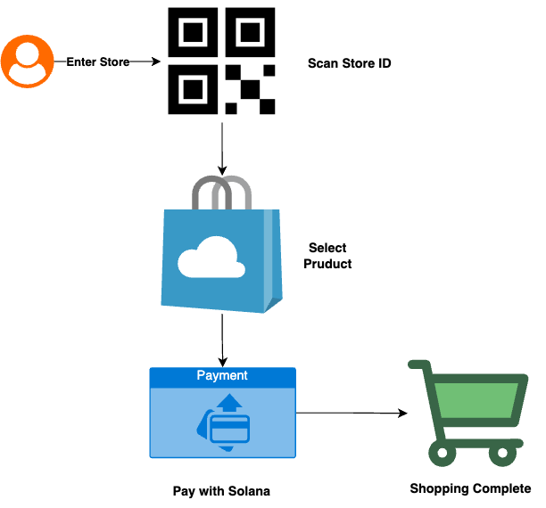
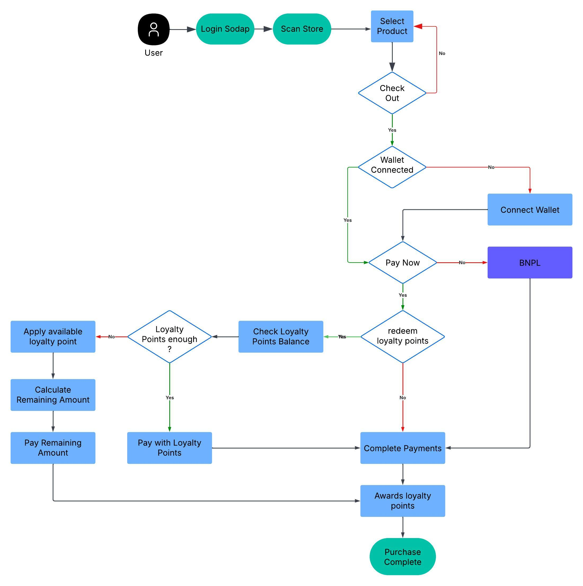
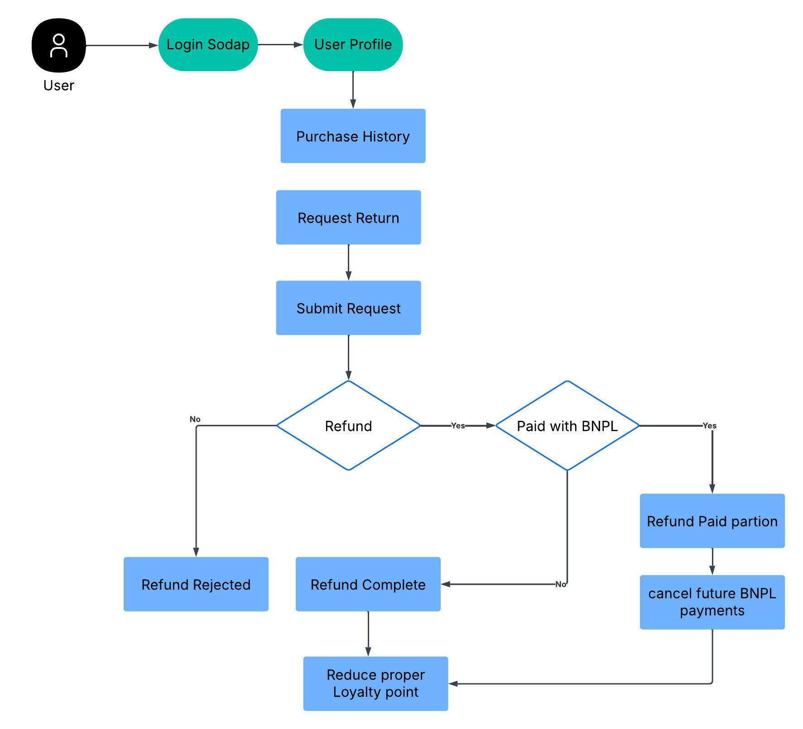

# SoDapV2.0 - Scan to go decentralized in-store shopping platform .

<div align="center">
  
  <h3> Sodap Fast Shopping </h3>
</div>

---

### 🌟 Overview

SoDapV2.0 is a decentralized in-store shopping platform on Solana with built-in Buy Now, Pay Later (BNPL), a transparent loyalty system, and verifiable refunds. Payments run through on-chain escrow for security and instant settlement, while BNPL and loyalty logic are enforced on-chain for consistency and fairness.
- BNPL: On-chain 20% downpayment with escrow; remaining balance is scheduled off-chain. Refunds return only the downpayment, preventing abuse and preserving merchant protection.
- Loyalty: Earn 10 points per 1 SOL actually paid; redeem at 100 points = 1 SOL. Points are awarded and deducted based on real spend and refund amounts.
- Refunds: Fast, transparent, and programmatic—escrow-backed and verified on-chain, aligned with BNPL and loyalty rules for predictable outcomes.

### 📖 Table of Contents

- [Overview](#-overview)
- [What's New in v2.0](#-whats-new-in-v20)
- [Key Features](#-key-features)
- [BNPL - Buy Now, Pay Later](#-bnpl-buy-now-pay-later)
  - [Downpayment and Refunds](#downpayment-and-refunds)
  - [BNPL Flow](#bnpl-flow)
- [Loyalty Points Program](#-loyalty-points-program)
  - [Earning Points](#earning-points)
  - [Redeeming Points](#redeeming-points)
  - [Refund Deductions](#refund-deductions)
- [Pay with Points](#-pay-with-points)
- [Blockchain Features](#-blockchain-features)
  - [Secure Store Management Using PDAs](#-secure-store-management-using-pdas)
  - [On-Chain Data](#-on-chain-data)
- [Tested Functionalities (18 Passing Tests)](#-tested-functionalities-18-passing-tests)
- [Getting Started](#-getting-started)
- [Architecture](#-architecture)
- [Development](#-development)
- [Contributing](#-contributing)
- [License](#-license)

---

### 🚀 What's New in v2.0

- **BNPL correctness & refunds**: BNPL refunds now return only the downpayment, not the full amount. Loyalty points deductions align with the amount actually paid.
- **Pay with Points (Direct & BNPL)**: Redeem loyalty points during checkout. Rate: 100 points = 1 SOL. For BNPL, the discount is applied to the total before calculating the 20% downpayment.
- **Loyalty points integration**: Earn 10 points per SOL you actually pay. Refunds deduct points accordingly. UI shows refund deductions with a red minus (e.g., -10).
- **Robust UX**: Payment dialog is responsive with fixed header/footer and scrollable content for smaller screens.

### ✨ Key Features

#### 🔐 Secure Payment with Solana

- **Instant Settlement**: Payments settle in seconds vs. days in traditional systems
- **Escrow Protection**: Smart contract escrow eliminates third parties and reduces fees
- **Transparent Refunds**: On-chain verification provides faster dispute resolution

#### 🔐 Authentication & User Management

- **Admin Management**: Add and remove admins with proper authorization checks
- **User Wallet Creation**: Create and verify user wallets directly on the blockchain
- **Role Verification**: Validate transaction authority based on wallet signatures

#### 🏪 Store Management

- **Store Registration**: Create stores with secure PDA-based identification
- **Metadata Updates**: Update store information with proper ownership verification
- **Owner-Based Control**: Store operations restricted to verified store owners

#### 🛒 Product Management

- **Product Registration**: Add products to stores with secure on-chain storage
- **Product Updates**: Modify product details with ownership verification
- **Product Deactivation**: Safely remove products from availability

#### 💳 Payment Processing

- **Purchase Cart**: Process purchases with escrow-based payment protection
- **Fund Release**: Securely transfer funds from escrow to store owners
- **Refund Handling**: Process refunds with proper authorization checks

### 🧾 BNPL - Buy Now, Pay Later

#### Downpayment and Refunds

- **Minimum downpayment**: 20% of the total after any points discount (on-chain enforced).
- **Escrow**: Only the downpayment is held in escrow for BNPL.
- **Refunds**: BNPL refunds return only the downpayment. Loyalty points are deducted based on what was actually paid (10 pts/SOL).
- **Grounded in code**:
  - On-chain: `sodap-mono/programs/sodap/src/instructions/bnpl.rs` (min_downpayment_percent = 2000), `sodap-mono/programs/sodap/src/lib.rs` (20% calculation).
  - Frontend refund flow: `sodap-mono/app/src/hooks/useRefundTransaction.ts`, `sodap-mono/app/src/components/dashboard/manager/RefundsTab.tsx`.
  - Tests: `sodap-mono/tests/bnpl_loyalty_integration.ts`.

#### BNPL Flow

- Choose BNPL in `PaymentMethodDialog`.
- Optionally redeem points (discount applies before downpayment calculation).
- Pay the 20% downpayment; remaining balance is scheduled off-chain/UI.
- If refunded, only the downpayment returns; points are deducted proportionally.


### 🎁 Loyalty Points Program

#### Earning Points

- Earn **10 points per 1 SOL actually paid**.
- Direct payments: points are based on the net amount after any points redemption.
- BNPL: points are based on the downpayment amount.
- Code: `sodap-mono/app/src/hooks/usePayment.ts`, `sodap-mono/app/src/hooks/useBnplPayment.ts`, `sodap-mono/programs/sodap/src/instructions/loyalty.rs`.

#### Redeeming Points

- **Redemption rate**: **100 points = 1 SOL**.
- Limits: You can’t redeem more than your available points or the order total.
- BNPL: Discount is applied to the order total first; then the 20% downpayment is computed on the discounted total.
- Code: `sodap-mono/app/src/components/payment/PaymentMethodDialog.tsx` (`pointsToSolRate = 100`, `downpaymentPercentage = 0.2`).

#### Refund Deductions

- Refunds trigger point deductions at **10 pts/SOL** of the refunded amount.
- BNPL refunds deduct based on the downpayment only.
- UI: Refund deductions are shown in red with a single minus (e.g., `-10`).
- Code: `sodap-mono/app/src/hooks/useRefundTransaction.ts`, `sodap-mono/app/src/components/profile/RewardsTab.tsx`.

### 🪙 Pay with Points

- Available for both Direct and BNPL payments in the checkout dialog.
- Real-time calculations, validation, and a “Max” button for quick redemption.
- Dynamic pay button reflects the final amount after redemption (and BNPL downpayment when selected).
- Code: `sodap-mono/app/src/components/payment/PaymentMethodDialog.tsx`.

---

### 🛡️ Blockchain Features

#### 💸 Secure Store Management Using PDAs

- **Program Derived Addresses (PDAs)**: Each store has a unique PDA that acts as a secure on-chain identifier.
- **Store-Specific Lamport Vaults**: Funds are managed in deterministic lamport vaults tied to each store's PDA.
- **On-Chain Product Management**: Immutable product details and pricing are stored securely.
- **Escrow Payment System**: PDAs handle escrow payments, ensuring buyer and seller protection.

#### 🔗 On-Chain Data

- Immutable product and store data for transparency.
- Cryptographically secure transactions to ensure trust and reliability.

#### 🧪 Tested Functionalities (18 Passing Tests)

##### Admin Management

1. **Add Admin**: Authorized addition of new admin accounts
2. **Remove Admin**: Secure removal of admin privileges
3. **Admin Authorization**: Proper verification of admin privileges
4. **Unauthorized Admin Operations**: Correct rejection of unauthorized admin operations

##### User Wallet Management

5. **Create User Wallet**: Successful creation of new user wallets
6. **Wallet Verification**: Proper verification of wallet ownership
7. **Wallet Funding**: Automatic funding of test accounts with sufficient SOL

##### Store Management

8. **Register Store**: Creation of new stores with proper ownership
9. **Update Store Metadata**: Secure updating of store information
10. **Store Owner Verification**: Verification of store ownership for operations

##### Product Management

11. **Register Product**: Addition of new products to stores
12. **Update Product**: Modification of existing product details
13. **Deactivate Product**: Proper deactivation of products
14. **Unauthorized Product Updates**: Rejection of unauthorized product modifications

##### Payment Processing

15. **Purchase Products**: Successful purchase of products with proper escrow
16. **Release Funds**: Secure release of funds from escrow to store owner
17. **Process Refunds**: Proper handling of refund requests
18. **Insufficient Funds Handling**: Graceful handling of insufficient funds errors

---

### 💪 Getting Started

#### Prerequisites:

- Node.js 18+ and npm/yarn
- Solana CLI tools (`solana-cli`)
- Anchor Framework 0.28.0 or higher
- Solana wallet with devnet SOL (at least 1.0 SOL per test account)

#### Installation:

```bash
git clone https://github.com/tenrikut/sodap-mono.git
cd sodap-mono
yarn install
```

#### Development:

- All tests are run on Solana devnet for realistic testing conditions
- Use `anchor test --provider.cluster devnet` to run tests on devnet
- Ensure your wallet has sufficient SOL (1.0 SOL per test account recommended)

---

### 🔧 Architecture

<div align="center">
  
  <p><em>SoDap Architecture Design</em></p>
</div>

#### Transaction Flows

##### Purchase Flow

The following diagram illustrates the purchase flow in SoDap, showing how customers interact with stores and the Solana blockchain:

<div align="center">
  
  <p><em>Purchase Flow Process</em></p>
  
</div>

##### BNPL Flow

The BNPL flow shows the downpayment step, optional points redemption, and refund handling:

<div align="center">
  
  <p><em>BNPL Flow Process</em></p>
</div>

##### Refund Flow

The following diagram illustrates the refund process in SoDap, showing how store managers process refund requests:

<div align="center">
  
  <p><em>Refund Flow Process</em></p>
</div>

#### Backend (Solana/Anchor)

- **Program Architecture**: Rust-based Anchor program with modular instruction handlers
- **Account Structure**: Uses PDAs (Program Derived Addresses) for deterministic account generation
- **State Management**: Stores data in structured accounts with proper ownership validation
- **Security Model**: Implements rigorous access control and transaction verification

#### Program Structure

```
programs/
├── sodap/
│   ├── src/
│   │   ├── lib.rs           # Main program entry point
│   │   ├── admin.rs         # Admin management functionality
│   │   ├── user.rs          # User wallet creation and verification
│   │   ├── store.rs         # Store management operations
│   │   ├── product.rs       # Product management operations
│   │   ├── payment.rs       # Payment processing and escrow
│   │   ├── errors.rs        # Custom error definitions
│   │   └── state.rs         # Account state definitions
│   └── Cargo.toml           # Rust dependencies
└── tests/                   # Integration tests
    ├── admin.ts             # Admin management tests
    ├── create_wallet.ts     # User wallet tests
    ├── store.ts             # Store management tests
    ├── product.ts           # Product management tests
    └── payment.ts           # Payment processing tests
```

#### Frontend (React/Vite)

- **UI Framework**: React with Vite for fast development and optimized builds
- **Wallet Integration**: Supports Phantom and other Solana wallets via wallet-adapter
- **State Management**: Context-based state management for user sessions and cart
- **Styling**: Modern UI with responsive design for all device types

#### Frontend Structure

```
src/
├── components/             # Reusable UI components
│   ├── common/             # Shared components (buttons, inputs, etc.)
│   ├── layout/             # Layout components (header, footer, etc.)
│   ├── store/              # Store-related components
│   └── product/            # Product-related components
├── pages/                  # Application pages
│   ├── Home.tsx            # Homepage
│   ├── Store.tsx           # Store details page
│   ├── Product.tsx         # Product details page
│   ├── Cart.tsx            # Shopping cart
│   └── Admin.tsx           # Admin dashboard
├── hooks/                  # Custom React hooks
│   ├── useWallet.ts        # Wallet connection hook
│   └── useProgram.ts       # Solana program interaction hook
├── context/                # React context providers
│   ├── WalletContext.tsx   # Wallet connection context
│   └── CartContext.tsx     # Shopping cart context
├── utils/                  # Utility functions
│   ├── program-interface.ts # Anchor program interface
│   └── constants.ts        # Application constants
└── App.tsx                 # Main application component
```

---

### 🔧 Development

#### Scripts:

- `anchor build` to build the program
- `anchor deploy --provider.cluster devnet` to deploy to devnet
- `anchor test --provider.cluster devnet` to run all tests on devnet
- `scripts/transfer-sol.js` to transfer SOL between wallets for testing

---

### 🤝 Contributing

1. Fork the repository
2. Create feature branches (`git checkout -b feature/amazing-feature`)
3. Ensure all tests pass with `anchor test --provider.cluster devnet`
4. Commit your changes (`git commit -m 'Add some amazing feature'`)
5. Push to the branch (`git push origin feature/amazing-feature`)
6. Open a Pull Request

---

### 📝 License

This project is licensed under the MIT License. See the [LICENSE](LICENSE) file for details.
